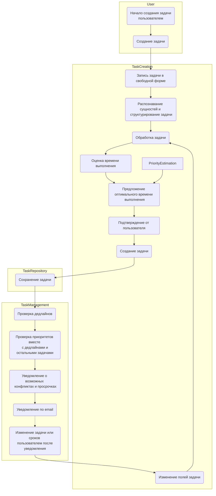

# Дизайн-документ

## Зачем идем в разработку продукта?

Проблема управления задачами становится острой в условиях высокой рабочей нагрузки и большого
количества запросов. Существующие инструменты вроде Jira или Google Sheets неудобны для личного
тайм-менеджмента, так как перегружены функционалом или лишены интеллектуальной поддержки. **Graphite
Time Management** разрабатывается для упрощения управления задачами и повышения эффективности с
помощью AI. Пользователю будет предоставлена удобная платформа, которая позволяет:

- Оценивать сроки выполнения задач с учетом предыдущего опыта.
- Оптимально распределять задачи по приоритетам и дедлайнам.
- Получать уведомления о возможных просрочках.

Цель продукта — помочь пользователям эффективно управлять личным временем, снизить уровень
переработки и стресс.

---

## Бизнес-требования и ограничения

### Бизнес-требования:

1. **Простота использования:**
    - Интерфейс должен быть интуитивно понятным – список задач с понятными приоритетами и
      дедлайнами.
2. **Интеграция с существующими системами:**
    - Возможность синхронизации с календарями (Google Calendar, Outlook).
3. **Искусственный интеллект:**
    - Модель должна предлагать реалистичные сроки и дедлайны на основе исторических данных.
    - Предупреждать о возможных конфликтах и пересечениях.
    - Оценивать вероятность выполнения задачи в срок.
4. **Гибкость в настройках:**
    - Возможность индивидуальной настройки приоритетов и дедлайнов вне подсказок модели.

### Ограничения:

1. Доступ к данным:
    - Исторические данные для обучения модели могут быть ограничены. Первые оценки могут быть
      неточными, пока модель не накопит достаточно данных для конкретного пользователя.
2. Технические:
    - Скорость работы должна быть высокой, чтобы не вызывать задержки в пользовательском опыте.
    - В первой версии не предполагается интеграция с другими системами управления задачами, кроме
      гугл-календаря.
3. Безопасность:
    - Обеспечить конфиденциальность пользовательских данных.
4. MVP:
    - Первая версия должна быть ориентирована на индивидуальное использование.

---

## Скоуп проекта

### Входит в скоуп:

- Создание базовой платформы управления задачами.
    - Web-интерфейс для создания и просмотра задач.
    - Backend для хранения данных и обработки запросов.
    - ML Backend для обучения модели и предсказаний.
- Реализация алгоритмов для:
    - Оценки времени выполнения задач.
    - Расстановки задач по приоритетам и дедлайнам.
    - Уведомления о потенциальной просрочке.
- Интеграция с календарями.
- Простая система уведомлений (email/встроенные уведомления).

### Не входит в скоуп:

- Расширенные функции командного управления (в первой версии).
- Глубокая интеграция с корпоративными инструментами и иными системами управления задачами.
- Мобильное приложение, десктопное приложение.

---

## Предпосылки решения

- Наличие исторических данных о задачах и времени их выполнения.
- Доступ к API календарей и других инструментов управления временем.
- Личная боль в управлении задачами и временем.

---

## Постановка задачи

Разработать платформу управления задачами с использованием машинного обучения, которая:

1. Оценивает время выполнения задачи.
2. Расставляет задачи по приоритетам.
3. Предлагает оптимальные слоты для выполнения с учетом календаря.
4. Уведомляет о возможных пересечениях и рисках просрочки.

---

## Блок-схема решения

---

## Дополнительная информация

- **Метрики успеха:** Время, затрачиваемое пользователем на управление задачами, и процент
  выполнения задач в срок.
- **Развитие:** Возможность масштабирования системы для командного использования.
- **Риски:**
    - Неактуальность боли у других пользователей.
    - Недостаточная корректность моделей в начальной версии может вызывать недоверие
      пользователей.
