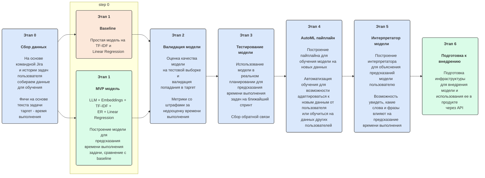

### 1. Цели и предпосылки

#### 1.1 Зачем идем в разработку продукта?

- **Бизнес-цель:** Создать инструмент для эффективного управления задачами, который решает проблемы
  перегрузки и просрочек за счет автоматизации планирования с помощью AI.
- **Преимущества ML:** Использование исторических данных для автоматического предсказания сроков и
  расстановки приоритетов. Уведомления помогут избежать просрочек. Это упрощает тайм-менеджмент,
  снижает стресс и повышает продуктивность.
- **Успех итерации:** Пользователи активно используют платформу, получают актуальные прогнозы сроков
  и заметное улучшение в управлении задачами (например, снижение количества пропущенных дедлайнов).

---

#### 1.2 Бизнес-требования и ограничения

- **Бизнес-требования:**
    1. Удобный интерфейс (список задач, простая навигация).
    2. Интеграция с календарями (Google Calendar, Outlook).
    3. AI, предсказывающий сроки и уведомляющий о возможных рисках.
    4. Возможность настройки дедлайнов и приоритетов вручную.

- **Бизнес-ограничения:**
    - Ограниченные данные на старте — модель может быть неточной в начале.
    - В первой версии поддерживаются только индивидуальные пользователи (без командного
      функционала).
    - Конфиденциальность данных пользователя должна быть гарантирована.

- **Цель итерации:** Создать MVP с базовым функционалом, включающим предсказание сроков, интеграцию
  с календарем и уведомления.

- **Процесс пилота:** Пользователь добавляет задачи, система расставляет приоритеты и предупреждает
  о рисках. Пилот тестируется на наборе задач от ранних пользователей.

- **Успешный пилот:** Пользователи сообщают о снижении пропущенных дедлайнов и удобстве
  использования.

---

#### 1.3 Что входит в скоуп проекта/итерации, что не входит

- **Входит:**
    - Web-интерфейс для управления задачами.
    - AI-модели для предсказания сроков.
    - Интеграция с Google Calendar.
    - Простые уведомления (email).

- **Не входит:**
    - Командное управление задачами.
    - Расширенные интеграции с корпоративными системами.
    - Мобильные и десктопные приложения.

- **Качество решения:** Решение должно быть воспроизводимым и документированным для дальнейшего
  развития.

---

#### 1.4 Предпосылки решения

- Исторические данные пользователя (о прошлых задачах и сроках).
- Доступ к API календарей (Google Calendar).
- Высокий интерес к инструменту упрощенного тайм-менеджмента на основе AI.

---

### 2. Методология

#### 2.1 Постановка задачи

- Построить ML-модель для предсказания сроков выполнения задач и оптимальной расстановки по
  приоритетам и времени в календаре.

---

#### 2.2 Блок-схема решени

Примерный флоу для конечного продукта (реализуется не в рамках курса), для которого строится ML система

---

#### 2.3 Этапы решения задачи

- **Этап 1: Подготовка данных**
    - Исторические данные о задачах, дедлайнах и времени выполнения.
    - Обработка данных для формирования целевой переменной (фактическое время выполнения).

- **Этап 2: Построение моделей**
    - Прогноз времени выполнения задачи.
    - Оценка вероятности выполнения задачи в срок.

- **Этап 3: Интеграция с календарем**
    - Расстановка задач в оптимальные временные слоты.

- **Этап 4: Уведомления**
    - Предупреждение пользователя о возможных рисках (просрочки, конфликт задач).

---

### 3. Подготовка пилота

#### 3.1 Способ оценки пилота

- Пользовательские метрики: количество задач, выполненных в срок, частота использования уведомлений.

#### 3.2 Что считаем успешным пилотом

- Повышение вовлеченности пользователей: > 80% активных пользователей возвращаются к платформе в
  течение недели.
- 50% пользователей отмечают улучшение в управлении задачами.

---

### 4. Внедрение

#### 4.1 Архитектура решения

- Backend для обработки задач и работы модели.
- Frontend для взаимодействия с пользователем.

#### 4.2 Описание инфраструктуры

- PostgreSQL для хранения данных о задачах.
- FastAPI для API и взаимодействия с моделью.
- Docker и Docker Compose для развертывания.
- TimeWeb для хостинга.
- Kafka для обработки сообщений и уведомлений.
- Google Calendar API для интеграции с календарем.
- JavaScript и React для фронтенда.

#### 4.3 Требования к системе

- SLA: Задержка < 10 секунд при выполнении предсказаний.
- SLA: 99% задач должны быть обработаны без ошибок.
- Интеграция с Google Calendar.
- Поддержка email-уведомлений.
- Доступ к API для интеграции с другими системами.

#### 4.4 Риски

- Ограниченные данные на старте могут снизить точность модели.
- Недостаточная вовлеченность пользователей.
- Проблемы с конфиденциальностью данных.

