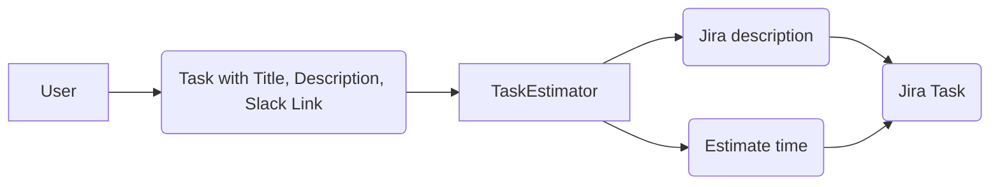

# Дизайн ML-системы: Предсказание времени выполнения задач

<!-- TOC -->

* [Дизайн ML-системы: Предсказание времени выполнения задач](#дизайн-ml-системы-предсказание-времени-выполнения-задач)
    * [1. Цели и предпосылки](#1-цели-и-предпосылки)
        * [1.1 Обоснование разработки продукта](#11-обоснование-разработки-продукта)
        * [1.2 Бизнес-требования и ограничения](#12-бизнес-требования-и-ограничения)
            * [Бизнес-требования](#бизнес-требования)
            * [Бизнес-ограничения](#бизнес-ограничения)
        * [1.3 Что входит в скоуп проекта/итерации, что не входит](#13-что-входит-в-скоуп-проектаитерации-что-не-входит)
            * [Входит](#входит)
            * [Не входит](#не-входит)
        * [1.4 Предпосылки решения](#14-предпосылки-решения)
    * [2. Методология](#2-методология)
        * [2.1 Постановка задачи](#21-постановка-задачи)
        * [2.2 Блок-схема решения](#22-блок-схема-решения)
        * [2.3 Этапы решения задачи](#23-этапы-решения-задачи)
    * [3. Подготовка пилота](#3-подготовка-пилота)
        * [3.1 Способ оценки пилота](#31-способ-оценки-пилота)
        * [3.2 Успешность пилота](#32-успешность-пилота)
    * [4. Использование сервиса в продакшн](#4-Использование-сервиса-в-продакшн) 

<!-- TOC -->

## 1. Цели и предпосылки

### 1.1 Обоснование разработки продукта

- **Бизнес-цель:** Предоставить инструмент, который поможет пользователям более точно планировать
  свое время, путем предсказания времени выполнения задач на основе исторических данных. Это
  позволит ускорить процесс планирования и улучшит оценку сроков выполнения задач.

- **Необходимость использования ML:** Традиционные методы оценки времени выполнения задач требуют
  времени на анализ и оценку. ML-модель позволит автоматически анализировать исторические данные и
  выявлять зависимости. Это позволит пользователям быстрее и точнее планировать свою работу.

- **Критерии успеха итерации:**
    - **Точность предсказаний:** Weighted Accuracy >
      50% ([3.1 Способ оценки пилота](#31-способ-оценки-пилота))
    - **Положительная обратная связь:** Пользователи (я, мой руководитель) отмечают улучшение в
      планировании задач.

---

### 1.2 Бизнес-требования и ограничения

#### Бизнес-требования

1. Точность предсказаний. Weighted Accuracy > 50% – описание ниже.
2. Производительность. Время отклика модели не должно превышать 10 секунд на один запрос.
    - Почему 10? Мы хотим использовать модель во время планирования задач. Условно 10-15 задач
      берется на одного человека и для каждой нужно предсказать время выполнения. На планировании
      выделено на одного человека 30 минут. 10 секунд на задачу – это (15 * 10 / 30) / 30 ~ 8.5% =
      10% времени на планирование. Больше 10% времени на ожидание ответа от модели выглядит
      неудобно.
3. Безопасность. Защита данных пользователей и конфиденциальность информации.

#### Бизнес-ограничения

1. Необходимо начать использование модели уже в январе 2024 года.
2. Обеспечение конфиденциальности и соответствие требованиям GDPR.
3. Ограничения на мощности локальных машин и / или затрат на облачные вычисления.

---

### 1.3 Что входит в скоуп проекта/итерации, что не входит

#### Входит

- Предоставление прогнозов времени выполнения задач на основе исторических данных с аргументацией.
- Swagger и REST API для доступа к системе.
- Документация по использованию API и модели.

#### Не входит

- Веб-интерфейс для управления задачами.
- Управление приоритетами и дедлайнами.

---

### 1.4 Предпосылки решения

- **Наличие данных:** Исторические данные о задачах и времени их выполнения доступны для обучения
  модели.
- **Reasoning в современных моделях:** Использование LLM и других современных методов для анализа
  текста в предсказании времени выполнения задач. Модели могут учитывать контекст и сложные
  зависимости между задачами, аргументировать свои решения.

---

## 2. Методология

### 2.1 Постановка задачи

- **Тип задачи:** Регрессия.
- **Описание:** Предсказать время выполнения задачи на основе ее описания и других доступных
  характеристик (например, тип задачи, сложность, связанные задачи).

---

### 2.2 Блок-схема решения


### 2.3 Этапы решения задачи

**Этап 1: Сбор и подготовка данных**

- Сбор исторических данных о задачах.
- Сборка пайплайна для автоматической обработки данных из Jira и Slack.
- Предобработка данных: очистка и нормализация текста.

Данные:

- Сырой текст треда из Slack, описывающий задачу.
- Описание задачи из Jira.
- Meeting notes, где упоминается задача и что необходимо сделать.

[HW2](https://gist.github.com/pacifikus/bada0e4b597852e4bb50512daf451929)\
_Описание "Этап 1. Подготовка данных"_:

- Процесс генерации данных заключается в сбор информации задач Jira, тредов в Slack и последующей
  нормализации с помощью LLM.
    - Сбор информации:
        - На вход парсеру поступает название проекта и ссылка на рабочую Jira
        - Идем по всем задачам в проекте и собираем информацию о них
        - Всегда есть Jira title, иногда есть Jira description
        - Еще реже есть ссылка на Slack тред
        - Если ссылка на Slack тред есть, то парсим его и собираем текст
        - На выходе получается датасет c сырым описанием из Jira и текстом из Slack
        - Дополнительно собираем информацию о времени выполнения задачи, уровне навыков исполнителя
          и времени, которое исполнитель работает в команде
    - Предобработка с LLM и очистка PII:
        - Задачи нужно привести их к единому формату из их описания и заголовка
        - **Нужно вычистить весь PII и конфиденциальную информацию**
- Для стандартизации датасета, общую информацию о задаче можно прогнать через LLM и получить
  стандартизированный текст на основе неструктурированных данных.
- **Итогом этого этапа должен стать датасет, в формате**

| column                    | type   | description                                                |
|---------------------------|--------|------------------------------------------------------------|
| `jira_key`                | `text` | ID задачи                                                  |
| `task_description_llm`    | `text` | Прошедший через LLM текст задачи со всеми деталями         |
| `assignee_level_order`    | `int`  | Условный уровень навыков исполнителя (1 / 2 / 3)           |
| `month_since_member_join` | `int`  | Количество месяцев, которое исполнитель работает в команде |
| `time_to_complete_hours`  | `int`  | Целевая переменная – время выполнения задачи в часах       |

PII:
В данных есть персональная информация, но мы готовы с ней ходить в Anthropic аккаунт компании.
Ограничение на использование данных – не распространять их за пределы компании. Для этого мы будем
использовать DVC и не будем публиковать данные в открытый доступ.

Риски:

1. Нет доступа к запросу API Jira – реализовался
    - [x] Способ решения – поиск API ключей в запросах браузера
2. Нет доступа к сбору информации из Slack – реализовался
    - [x] Способ митигации – добавить ботов в каналы, в личных сообщениях собрать информацию не
      получилось

**Этап 2.1: Разработка базовой модели**

- Построение базовой модели с использованием Word2Vec.
- Оценка базовой точности предсказаний.

Выход модели должен состоять из оценки времени выполнения задачи и уровня уверенности в предсказании

```json
{
    "predicted_hours": 4,
    "confidence": 0.8
}
```

**Этап 2.2: Разработка MVP модели**

- Построение MVP модели с использованием LLM, Embeddings, TF-IDF, ER и линейной регрессии.
- Выбор оптимальной архитектуры модели.

Одна модель должна быть обучена на том же датасете, что и базовая модель.
Следующая модель на этом этапе модель может учитывать контекст задачи, другие задачи пользователя,
его специализацию и другие факторы, влияющие на время выполнения задачи. Будем добавлять эмбеддинги
для текста задачи, из других задач, которые по некотрому расстоянию близки к текущей задаче.

Выход модели должен содержать дополнительные фичи, учитывающие контекст задачи и пользователя

```json
{
    "predicted_hours": 4,
    "confidence": 0.8,
    "description": "Some task description",
    "features": {
        "task_complexity": "High",
        "user_specialization": "Data Science",
        "definition_of_done": "Code review",
        "stake_holders": [
            "Product Owner",
            "Team Lead"
        ]
    }
}
```

**Риски данного этапа, и способы их снижения**

1. Недостаточно данных для обучения модели.
    - Способы снижения: Дополнительный сбор данных, аугментация данных, использование предобученных
      моделей. Аугментация будет заключаться в замене слов на синонимы, замены близких по контексту
      ключевых слов на другие, например, название одного вендора на другого. Перефразирование с
      помощью LLM задачи.
2. Недостаточная точность предсказаний.
    - Способы снижения: Использование ансамблей моделей, оптимизация гиперпараметров, анализ ошибок
      модели.

**Этап 3: Валидация модели**

- Оценка качества модели на тестовой выборке.
- Оценка точности предсказаний и попадания в таргет.
- Оценка метрик с учетом штрафов за недооценку времени выполнения.

Метрики:

- Доля недооцененных задач < 10%. `Estimated time < Real time.`
- Доля задач переоцененных более чем на 1 шаг стори поинта < 20%.
- Weighted Accuracy > 50%

**Этап 4: Тестирование модели**

- Использование модели в реальном планировании задач.
- Сбор обратной связи от пользователей. Проверка точности предсказаний метриками из этапа 4.
- Оценка эффективности модели в реальных условиях.

**Этап 5: Автоматизация и интерпретация**

- Построение AutoML пайплайна для обучения модели на новых данных.
- Создание REST API для доступа к модели.

Результаты модели должны быть доступны через REST API с возможностью получения предсказаний времени,
загрузки новых данных и дообучения модели.

**Этап 6: Интерпретация модели**

- Построение интерпретатора для объяснения предсказаний модели пользователю.
- Возможность увидеть, какие слова и фразы влияют на предсказание времени выполнения задач.

На этом этапе на выходе модели хочется видеть не только предсказание, но и объяснение, почему модель
сделала такое предсказание.

```json
{
    "predicted_hours": 4,
    "confidence": 0.8,
    "features": {
        "task_complexity": "High",
        "user_specialization": "Data Science",
        "definition_of_done": "Code review",
        "stake_holders": [
            "Product Owner",
            "Team Lead"
        ],
        "reasoning": {
            "task_complexity": "Due to some facts from tasks X, Y, Z and requirements A, B, C ..."
        }
    }
}
```

---

## 3. Подготовка пилота

### 3.1 Способ оценки пилота

- Метрики Критерии успеха.
    - Метрика точности с учетом асимметрии ошибок. Нам менее важно переоценить
      время выполнения задачи, чем недооценить. Точность предсказаний Weighted Accuracy > 50%. (
      Текущая метрика с ручной оценкой ~ 33%)
    - Производительность: Время отклика API – Latency ≤ 10 секунд.
    - Надежность: 95% запросов обрабатываются без ошибок.

$$
\text{Weighted Accuracy} = 100\% \times \left( 1 - \frac{\sum_{i=1}^{N} W_i \cdot |T_{\text{pred}, i} - T_{\text{actual}, i}|}{\sum_{i=1}^{N} T_{\text{actual}, i}} \right)
$$

Где:

- $T_{\text{pred}, i}$ — предсказанное время выполнения задачи \( i \).
- $T_{\text{actual}, i}$ — фактическое время выполнения задачи \( i \).
- $W_i$ — вес ошибки:

$$
W_i =
\begin{cases}
\alpha, & \text{если } T_{\text{pred}, i} < T_{\text{actual}, i}, \\
1, & \text{если } T_{\text{pred}, i} \geq T_{\text{actual}, i}.
\end{cases}
$$

- $alpha$ — коэффициент штрафа за недооценку времени (например, $alpha = 2$).
- $N$ — общее количество задач.

### 3.2 Успешность пилота

- Успешный пилот:
    - Достижение поставленных метрик.
    - Положительная обратная связь от тестовых пользователей.
    - Отсутствие критических ошибок в работе модели и API.


# 4. Использование сервиса в продакшн

## 4.1 Нагрузочное тестирование и его результаты описаны 
Для MVP и внутреннего использования внутри небольшой команды нагрузочное тестирование не необходимо. Поток пользователей ожидается 1-2 юзера в день с 4-10 запросов.


## 4.2 Схема использования сервиса



